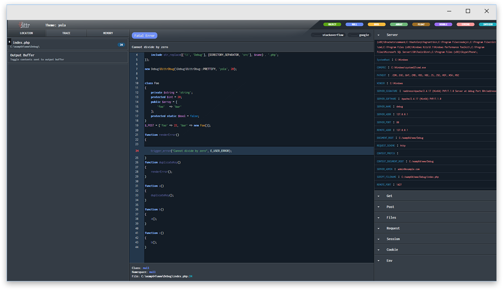

# Dbug a *very lightweight Error/Exception handler for PHP(7+)

Basic usage:
```php
use Dbug\BittrDbug;

/**
 * @param error handle type
 * @param theme name (bittr|default|yola). Themes can be configures in theme.json
 * @param lines of code to cover before and after the error.
 */
new BittrDbug(BittrDbug::PRETTIFY, 'yola', 20);
#This should be implemented before any other script execution except your autoloader(if using one).
```
Output protoype:


Using callback function:
```php
use Dbug\BittrDbug;

new BittrDbug(function (\Throwable $e) {
    var_dump($e->getMessage());
});
#This should be implemented before any other script execution except your autoloader(if using one).
```

You can also log errors instead of outputting them in browser:
```php
use Dbug\BittrDbug;

/**
 * @param error handle type
 * @param path to save log files.
 */
new BittrDbug(BittrDbug::FILE_LOG, 'path/to/my/log/');
#This should be implemented before any other script execution except your autoloader(if using one).
```
